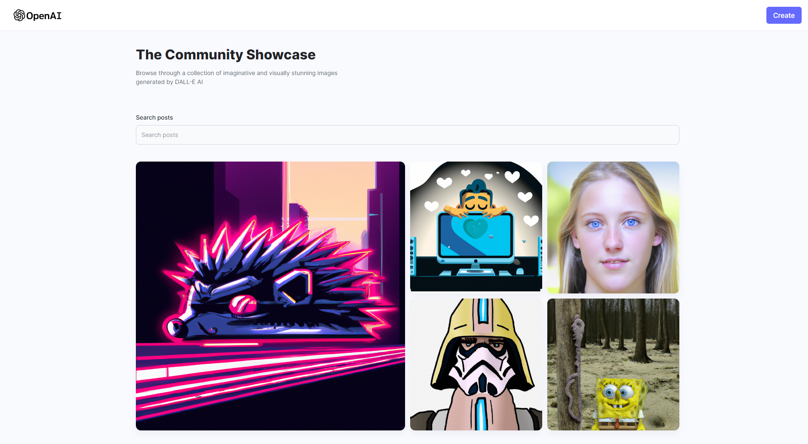

<a name="readme-top"></a>
<div align="center">

  
  

  <h1>DALL-E Coummnity</h1>
  
  <p>
    DALL-E Community is a Full Stack MERN AI Image Generation App using OpenAI DALL-E ML models.
  </p>

<!-- Badges -->
<p>
  <a href="https://github.com/ladunjexa/DALL-E-MERN-App/graphs/contributors">
    
  </a>
  <a href="">
    
  </a>
  <a href="https://github.com/ladunjexa/DALL-E-MERN-App/network/members">
    
  </a>
  <a href="https://github.com/ladunjexa/DALL-E-MERN-App/stargazers">
    
  </a>
  <a href="https://github.com/ladunjexa/DALL-E-MERN-App/issues/">
    
  </a>
  <a href="https://github.com/ladunjexa/DALL-E-MERN-App/blob/master/LICENSE">
    
  </a>
</p>
   
 <h4>
    <a href="https://zen-ai-gpt-dall-e.vercel.app/">View Demo</a>
  <span> · </span>
    <a href="https://github.com/ladunjexa/DALL-E-MERN-App">Documentation</a>
  <span> · </span>
    <a href="https://github.com/ladunjexa/DALL-E-MERN-App/issues/">Report Bug</a>
  <span> · </span>
    <a href="https://github.com/ladunjexa/DALL-E-MERN-App/issues/">Request Feature</a>
  </h4>
</div>

<br />

<!-- Table of Contents -->
<details>

<summary>

# :notebook_with_decorative_cover: Table of Contents

</summary>

- [About the Project](#star2-about-the-project)
  * [Folder Structure](#bangbang-folder-structure)
  * [Environment Variables](#key-environment-variables)
  * [Tech Stack](#space_invader-tech-stack)
- [Getting Started](#toolbox-getting-started)
  * [Installation](#gear-installation)
  * [Run Locally](#running-run-locally)
- [Contributing](#wave-contributing)
- [License](#warning-license)
- [Contact](#handshake-contact)
- [Acknowledgements](#gem-acknowledgements)

</details>  

<!-- About the Project -->
## :star2: About the Project

<div align="center"> 
  
</div>
<br />

DALL-E Community allows you to create imaginative and visually stunning images generated by DALL-E AI and share them with the community by the powerful MERN stack,
using most popular CSS framework TailwindCSS, OpenAI's DALL-E model - A deep learning model that generates image from text-input and Cloudinary which is a cloud based image storage service 

<!-- Folder Structure -->
### :bangbang: Folder Structure

The folder structure of ZenAI is separated into server-side and client-side.
```
DALL-E-MERN-App/
|- client/
  |-- src/
    |-- assets/
    |-- components/
    |-- constants/
    |-- pages/
    |-- utils/
  |-- App.jsx
|- server/
  |-- mongodb/
    |-- models/
  |-- routes/
  |-- index.js
```

Now, lets dive into the server and client folders.

#### client

Responsive layout and elegant UI (User Interface) that encourages fruitful imagination and sharing using TailwindCSS

##### components

`Card.jsx` - `FormField.jsx` - `Loader.jsx`
This folder houses all components used for DALL-E Community, such as Card, FormField and Loader.

##### constants

`index.js` - DALL-E Community allows you to create an image by `Surprise Me` button, this file contains a constant array with prompts of different types.

##### pages

`createPost.jsx` - `Home.jsx`

This folder houses pages used for DALL-E Coummunity, such as `CreatePost: /create-post` route activity and `Home: /` route activity.
In these files, the logic and communication between client-side and the serer-side using the `fetch` function, as well, the implementation of the UI using reusable components.

##### utils

`index.js` - This file consist two functions called `getRandomPrompt` and `downloadImage`, where `getRandomPrompt` used for smart random selection, in which the preious `prompt` is passed as a paremeter so we get a different prompt. `downloadImage` is a simple implementation of `File-Saver` package in order to enable the downloading of images and match the file name to the id of the img.

#### server

The server-side handles eerything related to the application's communication with various APIs as well as handling storage through a database.
DALL-E community server-side implemented using Node.js, Express.js, MongoDB, OpenAI-API and Cloudinary.

`index.js` creates a server using using the Express.js library, and it sets up two routes `api/v1/post` and `api/v1/dalle` that handles different types of request, it also uses the CORS library to allow requests from any origin, and it increases the maximum file size of data that can be sent in the body of a request to 50MB. It also connects to a MongoDB database and it listens to incmoing requests on port `8080`. When someone makes a GET request to the server's root route ("/"), it sends back a message "Hello from DALL-E".

##### mongodb

`models` folder consist model class file for Post (`Post.js`) by [mongoose.Schema] which defines the structure of the document, default values, validators, etc., whereas a Mongoose model provides an interface to the database for creating, querying, updating, deleting records.

`connect.js` - as it named, handles configure application's connection to a MongoDB deployment using mongoose.

#### routes

`dalleRoutes.js` - `postRoutes.js`

`routes` folder files refers to how an application's endpoint (URIs) respond to client requests make the path mapping using Express.js with [express.Router].

`dalleRoutes.js` sets up a route for server. when someone makes a POST request to the serer with a [prompt] in the request body, it sends a request to the OpenAI API using the prompt and some other specified parameters, then it receies an image in response and sends it back to the user in the response.
`postRoutes.js` sets up a route for server, when someone makes a GET request to the server, it gets all the post data from a MongoDB database and sends it back to the user in the response.
When someone makes a POST request to the server with some specified fields in the request body, such as [name], [prompt] and [photo], it uploads the pohot to Cloudinary, a cloud-base image and video management service, and then it stores the post data including the photo's URL, [name] and [prompt] in the MongoDB database.
<br />

<!-- ENV VARIABLES -->
### :key: Environment Variables

Server-Side uses dotenv library to set configuration from .env file, In order to use DALL-E community you have to create OpenAI api key [here](https://openai.com/api) and a Cloudinary account [here](https://cloudinary.com/), to run this webapp, you will need to add the following environment variables to your `.env` file, which need to be located in `server` root folder.

```
MONGODB_URL=<MONGO_URL>
OPENAI_API_KEY=<OPENAI_API_KEY>
CLOUDINARY_CLOUD_NAME=<CLOUDINARY_CLOUD_NAME>
CLOUDINARY_API_KEY=<CLOUDINARY_API_KEY>
CLOUDINARY_API_SECRET=<CLOUDINARY_API_SECRET>
```

<!-- TechStack -->
### :space_invader: Tech Stack


<p align="right">(<a href="#readme-top">back to top</a>)</p>

<!-- Getting Started -->
## 	:toolbox: Getting Started

<!-- Installation -->
### :gear: Installation

#### Step 1:
Download or clone this repo by using the link below:

```bash
 https://github.com/ladunjexa/DALL-E-MERN-App
```

#### Step 2:

DALL-E Co using NPM (Node Package Manager), therefore, make sure that Node.js is installed by execute the following command in console:

```bash
  node -v
```

#### Step 3:

Go to client & server folders and execute the following command in console to get the required dependencies:

```bash
  npm install
```

#### Step 4:

Within the server-side folder create a file named `.env` and add the following [environment variable](#key-environment-variables)

<!-- Run Locally -->
### :running: Run Locally

#### Step 1:

Go to server folder and execute the following command in console to run the server-side:

```bash
  npm start
```

#### Step 2:

Go to client folder and execute the following command in console to run the client-side:

```bash
  npm run dev
```

<p align="right">(<a href="#readme-top">back to top</a>)</p>

<!-- Contributing -->
## :wave: Contributing

<a href="https://github.com/ladunjexa/DALL-E-MERN-App/graphs/contributors">
  
</a>

Contributions are always welcome!

See [`contributing.md`](https://contributing.md/) for ways to get started.

Contributions are what make the open source community such an amazing place to learn, inspire, and create. Any contributions you make are **greatly appreciated**.

If you have a suggestion that would make this better, please fork the repo and create a pull request. You can also simply open an issue with the tag "enhancement".
Don't forget to give the project a star! Thanks again!

1. Fork the Project
2. Create your Feature Branch (`git checkout -b feature/AmazingFeature`)
3. Commit your Changes (`git commit -m 'Add some AmazingFeature'`)
4. Push to the Branch (`git push origin feature/AmazingFeature`)
5. Open a Pull Request

<p align="right">(<a href="#readme-top">back to top</a>)</p>

<!-- License -->
## :warning: License

Distributed under the MIT License. See [LICENSE.txt](https://github.com/ladunjexa/DALL-E-MERN-App/blob/main/LICENSE) for more information.

<p align="right">(<a href="#readme-top">back to top</a>)</p>

<!-- Contact -->
## :handshake: Contact

Liron Abutbul - [@lironabutbul6](https://twitter.com/lironabutbul6) - [@ladunjexa](https://t.me/ladunjexa)

Project Link: [https://github.com/ladunjexa/DALL-E-MERN-App](https://github.com/ladunjexa/DALL-E-MERN-App)

<p align="right">(<a href="#readme-top">back to top</a>)</p>

<!-- Acknowledgments -->
## :gem: Acknowledgements

This section used to mention useful resources and libraries that used in DALL-E Community

 - [OpenAI API](https://openai.com/api)
 - [Cloudinary](https://cloudinary.com)
 - #JSMastery

<p align="right">(<a href="#readme-top">back to top</a>)</p>
